# Xposed hook so文件函数详解

## 一、前言

我们在进行so层的hook时，首先掌握对so文件的特点，和so文件的产生，是非常重要的。而要详细的了解这些知识，我们应该从最开始的程序编译过程开始了解。

## 二、编译原理

### 1.编译过程


我们可以借助gcc来实现上面的过程：

```java
预处理阶段：预处理器（cpp）根据以字符#开头的命令修给原始的C程序，结果得到另一个C程序，通常以.i作为文件扩展名。主要是进行文本替换、宏展开、删除注释这类简单工作。 
	命令行：gcc -E hello.c hello.i
编译阶段：将文本文件hello.i翻译成hello.s，包含相应的汇编语言程序
汇编阶段：将.S文件翻译成机器指令，然后把这些指令打包成一种可重定位目标程序的格式，并把结果保存在目标文件.o中（汇编——>机器）
	命令行：gcc -c hello.c hello.o
链接阶段：hello程序调用了printf函数，链接器（Id）就把printf.o文件并入hello.o文件中，得到hello可执行文件，然后加载到存储器中由系统执行。
	函数库包括静态库和动态库
	静态库：编译链接时，把库文件代码全部加入可执行文件中，运行时不需要库文件，后缀为.a。
	动态库：编译链接时，不加入，在程序执行时，由运行时链接文件加载库，这样节省开销，后缀为.so。（gcc编译时默认使用动态库）
再经过汇编器和连接器的作用后输出一个目标文件，这个目标文件为可执行文件
```

这里我们对编译过程做了一个初步的讲解，详细大家可以去看《程序员的自我修养——链接、装载与库》一书，下面我们主要介绍链接方式、链接库、可执行目标文件几个基本概念。

### （1）链接方式

**静态链接：**

```java
	对于静态库，程序在编译链接时，将库的代码链接到可执行文件中，程序运行时不再需要静态库。在使用过程中只需要将库和我们的程序编译后的文件链接在一起就可形成一个可执行文件。
```

**缺点：**

```java
1、内存和磁盘空间浪费：静态链接方式对于计算机内存和磁盘的空间浪费十分严重。假如一个c语言的静态库大小为1MB，系统中有100个需要使用到该库文件，采用静态链接的话，就要浪费进100M的内存，若数量再大，那浪费的也就更多。
2.更新麻烦：比如一个程序20个模块，每个模块只有1MB，那么每次更新任何一个模块，用户都得重新下载20M的程序
```

**动态链接：**

```
	由于静态链接具有浪费内存和模块更新困难等问题，提出了动态链接。基本实现思想是把程序按照模块拆分成各个相对独立部分，在程序运行时才将他们链接在一起形成一个完整的程序，而不是像静态链接那样把所有的程序模块都链接成一个单独的可执行文件。所以动态链接是将链接过程推迟到了运行时才进行。
```

例子：

```
	同样，假如有程序1，程序2，和Lib.o三个文件，程序1和程序2在执行时都需要用到Lib.o文件，当运行程序1时，系统首先加载程序1，当发现需要Lib.o文件时，也同样加载到内存，再去加载程序2当发现也同样需要用到Lib.o文件时，则不需要重新加载Lib.o，只需要将程序2和Lib.o文件链接起来即可，内存中始终只存在一份Lib.o文件。
```

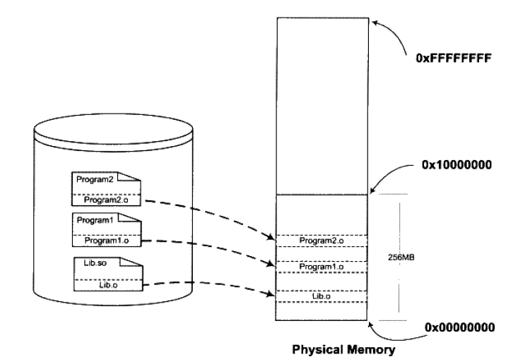

优点：

```java
（1）毋庸置疑的就是节省内存；
（2）减少物理页面的换入换出；
（3）在升级某个模块时，理论上只需要将对应旧的目标文件覆盖掉即可。新版本的目标文件会被自动装载到内存中并且链接起来；
（4）程序在运行时可以动态的选择加载各种程序模块，实现程序的扩展。
```

### （2）链接库

我们在链接的过程中，一般会链接一些库文件，主要分为静态链接库和动态链接库。静态链接库一般为`Windows下的.lib和Linux下的.a`,动态链接库一般为`Windows下的.dll和Linux下的.so`，这里考虑到我们主要是对so文件hook讲解，下面我们主要介绍linux系统下的情况。

**静态库：**

```
命名规范为libXXX.a
库函数会被连接进可执行程序，可执行文件体积较大
可执行文件运行时，不需要从磁盘载入库函数，执行效率较高
库函数更新后，需要重新编译可执行程序
```

**动态库：**

```
命名规范为libXXX.so
库函数不被连接进可执行程序，可执行文件体积较小
可执行文件运行时，库函数动态载入
使用灵活，库函数更新后，不需要重新编译可执行程序
```

### （3）可执行文件（ELF）

目前PC平台比较流行的可执行文件格式主要是Windows下的PE和Linux下的ELF，它们都是COFF格式的变种。在Windows平台下就是我们比较熟悉的.exe文件，而Linux平台下现在便是统称的ELF文件。这里我们主要介绍一下Linux下的ELF文件。

**ELF文件的类型：**

```java
可重定位目标文件：包含二进制代码和数据，其形式可以和其他目标文件进行合并，创建一个可执行目标文件。比如linux下的.o文件
可执行目标文件：包含二进制代码和数据，可直接被加载器加载执行。 比如/bin/sh文件
共享目标文件：可被动态的加载和链接。            比如.so文件
Core Dump File：进程意外终止时可以产生的文件，存储着该进程的内存空间中的内容等信息  比如core dump文件
```

**ELF文件的结构：**

elf文件在不同的平台上有不同的格式，在Unix和x86-64 Linux上称ELF：

目标文件既要参与程序链接，又要参与程序执行：


```java
(1)文件开始处：是一个ELF头部（ELF Header），用来描述整个文件的组织。节区部分包含链接视图的大量信息：指令、数据、符号表、重定位信息等。
(2)程序头部表：如果存在的话，会告诉系统如何创建进程映像。用来构造进程映像的目标文件必须具有程序头部表，可重定位文件不需要这个表。
(3)节区头部表：包含了描述文件节区的信息，每个节区在表中都有一项，每一项给出诸如节区名称、节区大小这类信息。用于链接的目标文件必须包含节区头部表，其他目标文件可以有，也可以没有这个表。
```


```java
ELF Header:描述了描述了体系结构和操作系统等基本信息并指出Section Header Table和Program Header Table在文件中的什么位置
Program Header Table: 保存了所有Segment的描述信息；在汇编和链接过程中没有用到，所以是可有可无的
Section Header Table:保存了所有Section的描述信息；Section Header Table在加载过程中没有用到，所以是可有可无的
```

其他字段可以参考下面的图表中所示：


下面我们再查看一个详细的ELF的结构图：

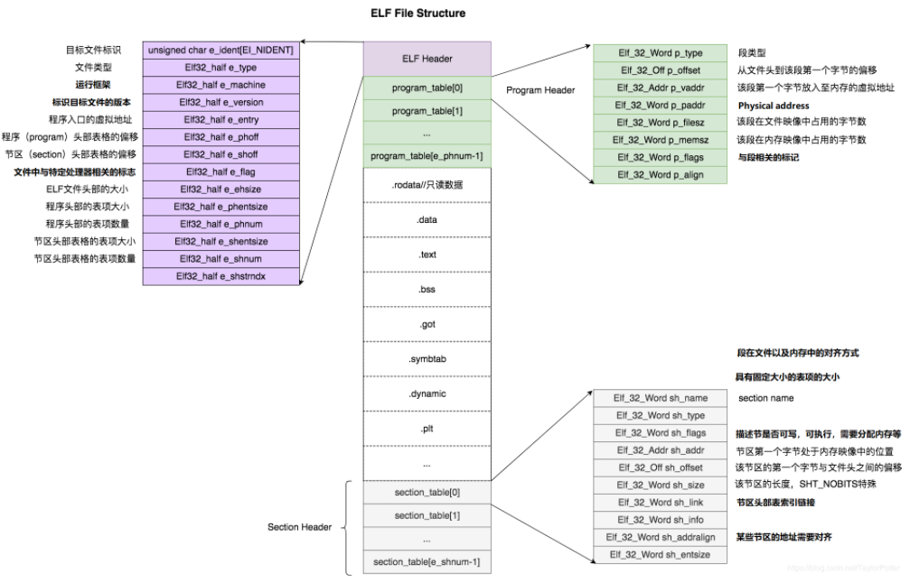

## 三、inlineHook原理

### 1.基本原理

首先，我们先介绍一下什么是inline Hook:

```
	inline Hook是一种拦截目标函数调用的方法，主要用于杀毒软件、沙箱和恶意软件。一般的想法是将一个函数重定向到我们自己的函数，以便我们可以在函数执行它之前和/或之后执行处理；这可能包括：检查参数、填充、记录、欺骗返回的数据和过滤调用。
	hook是通过直接修改目标函数内的代码来放置，通常是用跳转覆盖的前几个字节，允许在函数进行任何处理之前重定向执行。
```

### 2.inlineHook组成

```
hook:一个5字节的相对跳转，在被写入目标函数以钩住它，跳转将从被钩住的函数跳转到我们的代码
proxy:这是我们指定的函数（或代码），放置在目标函数上的钩子将跳转到该函数（或代码）
Trampoline:用于绕过钩子，以便我们可以正常调用钩子函数
```

### 3.inlineHook实现


从示意图上，我们可以这样理解：

```
我们将目标函数MessgeBoxA()中的地址拿出来，然后我们用重写的hook函数替换，然后我们执行完成之后，再回调到函数的执行地址出，保证程序的正常运行
```


我们也可以通过上述示意图去理解inlinehook的基本原理

## 四、NDK开发基础

我们在这里主要介绍部分NDK开发的基本知识，主要为后文做介绍

### 1.NDK so文件的类型

NDK开发的so不再具备跨平台特性，需要编译提供不同平台支持


我们从官网可以得知so文件在不同架构下也不同，这里依次对应`arm32位和64位，x86_32位和64位`

我们可以使用指令查看我们手机的架构：

```java
adb shell
cat /proc/cpuinfo
```

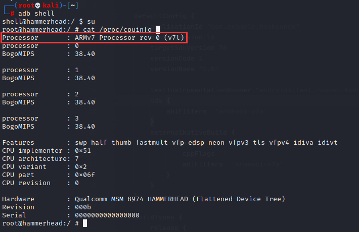

### 2.so文件加载

Android中我们通常使用系统提供的两种API：System.loadLibrary或者System.load来加载so文件：

```
//加载的是libnative-lib.so，注意的是这边只需要传入"native-lib"
System.loadLibrary("native-lib");
//传入的是so文件完整的绝对路径
System.load("/data/data/应用包名/lib/libnative-lib.so")
```

System.loadLibrary()和System.load()的区别：

```java
（1）loadLibray传入的是编译脚本指定生成的so文件名称，一般不需要包含开头的lib和结尾的.so，而load传入的是so文件所在的绝对路径
（2）loadLibrary传入的不能是路径，查找so时会优先从应用本地路径下(/data/data/${package-name}/lib/arm/)进行查找 不存在的话才会从系统lib路径下(/system/lib、/vendor/lib等)进行查找；而load则没有路径查找的过程
（3）load传入的不能是sdcard路径，会导致加载失败，一般只支持应用本地存储路径/data/data/${package-name}/，或者是系统lib路径system/lib等这2类路径
（4）loadLibrary加载的都是一开始就已经打包进apk或系统的so文件了，而load可以是一开始就打包进来的so文件，也可以是后续从网络下载，外部导入的so文件
（5）重复调用loadLibrar,load并不会重复加载so，会优先从已加载的缓存中读取，所以只会加载一次
（6）加载成功后会去搜索so是否有"JNI_OnLoad"，有的话则进行调用，所以"JNI_OnLoad"只会在加载成功后被主动回调一次，一般可以用来做一些初始化的操作，比如动态注册jni相关方法等
```

**源码分析：**

**Android 6.0：**

[System.java] java.lang.System:

```java
  public static void load(String pathName) {
        Runtime.getRuntime().load(pathName, VMStack.getCallingClassLoader());
   }

   public static void loadLibrary(String libName) {
       Runtime.getRuntime().loadLibrary(libName, VMStack.getCallingClassLoader());
}
```

[Runtime.java] java.lang.Runtime:

```java
 void load(String absolutePath, ClassLoader loader) {
        if (absolutePath == null) {
            throw new NullPointerException("absolutePath == null");
        }
        String error = doLoad(absolutePath, loader);
        if (error != null) {
            throw new UnsatisfiedLinkError(error);
        }
    }
public void loadLibrary(String nickname) {
        loadLibrary(nickname, VMStack.getCallingClassLoader());
    }

void loadLibrary(String libraryName, ClassLoader loader) {
        if (loader != null) {
            String filename = loader.findLibrary(libraryName);
            if (filename == null) {...
```

我们对比了Android6.0下的System.load和System.loadLibrary:

```
我们可以发现System.loadLibrary()中会修改类加载器，这个在我们后面hook过程可能会报错，而Runtime.loadLibray()中有重写的方法，则可以正确实现
```

**Android 7.0：**

[System.java] java.lang.System:

```java
  public static void load(String filename) {
        Runtime.getRuntime().load0(VMStack.getStackClass1(), filename);
    }
   
  public static void loadLibrary(String libname) {
        Runtime.getRuntime().loadLibrary0(VMStack.getCallingClassLoader(), libname);
    }
```

[Runtime.java] java.lang.Runtime:

```java
 synchronized void load0(Class fromClass, String filename) {
        if (!(new File(filename).isAbsolute())) {
            throw new UnsatisfiedLinkError(
                "Expecting an absolute path of the library: " + filename);        }
        if (filename == null) {
            throw new NullPointerException("filename == null");
        }
        String error = doLoad(filename, fromClass.getClassLoader());
        if (error != null) {
            throw new UnsatisfiedLinkError(error);
        }
    }
    
     public void loadLibrary(String libname, ClassLoader classLoader) {
        java.lang.System.logE("java.lang.Runtime#loadLibrary(String, ClassLoader)" +
                              " is private and will be removed in a future Android release");
       loadLibrary0(classLoader, libname);
    }
```

我们可以发现不同版本的区别：

```java
Android 6.0采用的是loadLibrary,6.0之后都采用的是loadLibrary0; 同理 load函数也一样,6.0之后采用的是load0
```

同时我们分析了loadLibrary0：

```java
1. classLoader存在时，通过classLoader.findLibrary(libraryName)来获取存放指定so文件的路径；
2. classLoader不存在时，则通过getLibPaths()接口来获取
3. 最终调用nativeLoad加载指定路径的so文件
```

## 五、hook案例实战

### 1.32位so文件函数hook——inlinehook库

我们对so文件进行hook时，可以按照如下步骤进行：

```java
（1）查看so文件中的目标函数
（2）编写Xposed hook代码，hook目标程序
（3）编写so层hook代码，hook so中的函数地址
（4）链接Java层和so层
```

#### （1）编写目标函数so文件

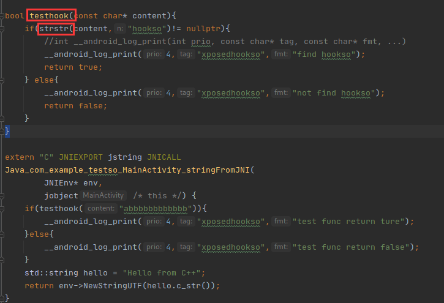

我们运行后发现打印信息：


经过分析，我们只需要hook testhook函数或strstr函数，我们这里尝试hook系统so层的strstr函数

#### （2）编写java层Xposed框架代码

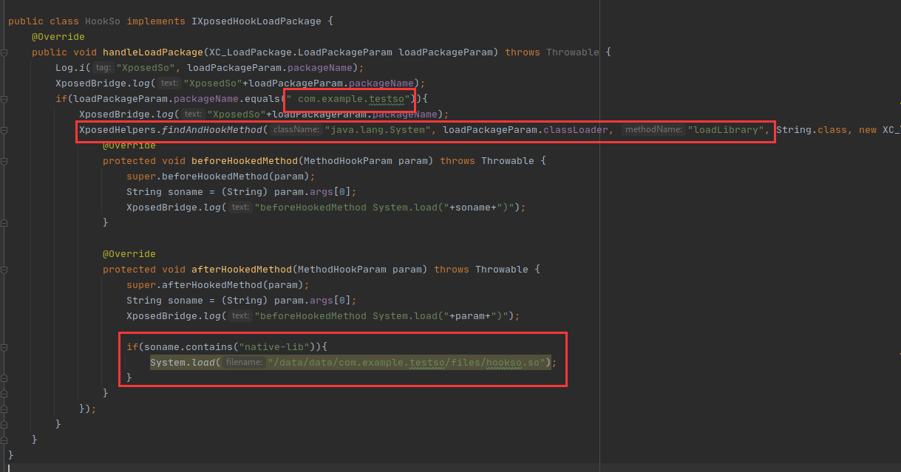

我们对目标程序进行hook，然后对目标程序中的System.loadLibrary()函数进行hook，如果我们判断native-lib库被加载，我们在加载我们编写的hookso.so，在里面实现对so文件的hook

#### （3）编写so层hook代码

我们需要使用[inlineHook](https://github.com/ele7enxxh/Android-Inline-Hook)文件夹，并把这些文件直接拷贝到我们的工作目录：

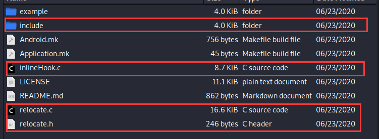


我们编写hook代码：


我们可以参考样例改写hook代码

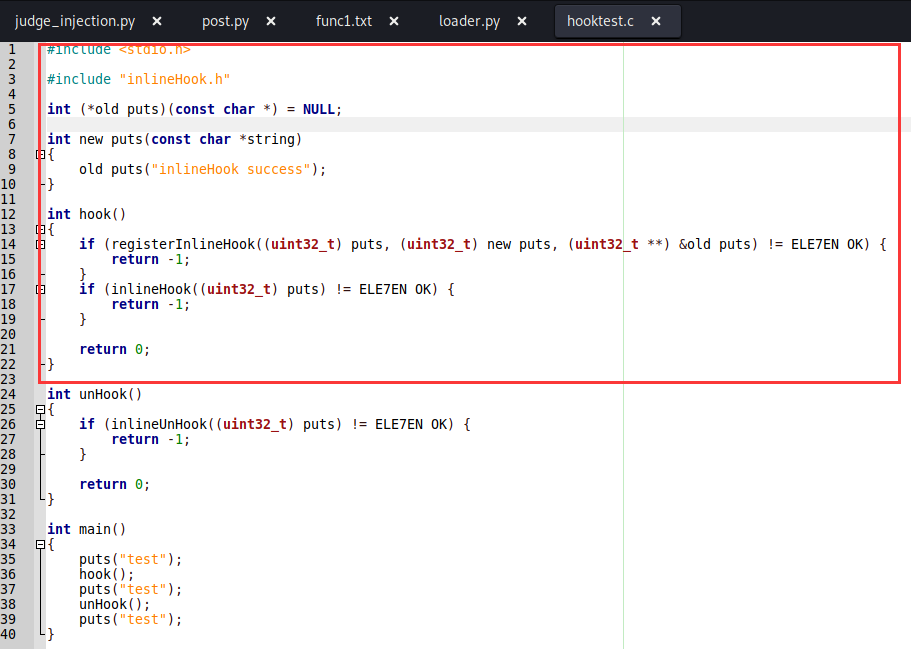

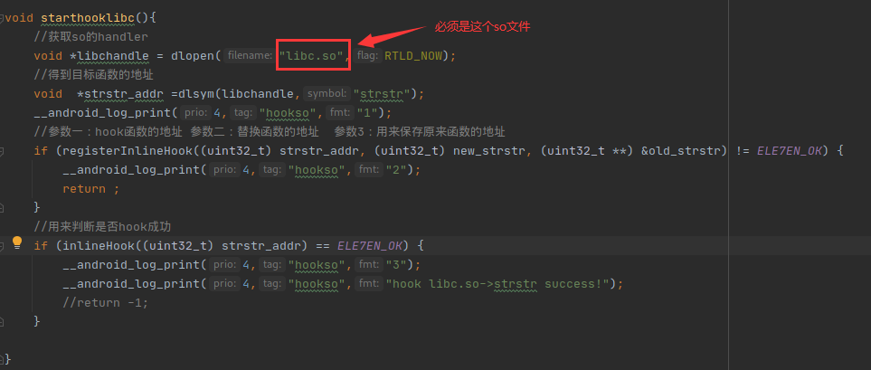

代码分析：

```java
源码解析：
	（1）dlopen：该函数将打开一个新库，并把它装入内存
		void *dlopen(const char *filename, int flag);
		参数1：文件名就是一个动态库so文件，标志位：RTLD_NOW 的话，则立刻计算；设置的是 RTLD_LAZY，则在需要的时候才计算
		libc.so是一个共享库
		======================
		参数中的 libname 一般是库的全路径，这样 dlopen 会直接装载该文件；如果只是指定了库名称，在 dlopen 会按照下面的机制去搜寻：
		根据环境变量 LD_LIBRARY_PATH 查找
		根据 /etc/ld.so.cache 查找
		查找依次在 /lib 和 /usr/lib 目录查找。
		flag 参数表示处理未定义函数的方式，可以使用 RTLD_LAZY 或 RTLD_NOW 。 RTLD_LAZY 表示暂时不去处理未定义函数，先把库装载到内存，等用到没定义的函数再说； RTLD_NOW 表示马上检查是否存在未定义的函数，若存在，则 dlopen 以失败告终。
		参考链接：https://blog.nowcoder.net/n/5b2c04bbcccf431e9f1ab34aa02717fe
		=======================
	（2）dlsym:在 dlopen 之后，库被装载到内存。 dlsym 可以获得指定函数( symbol )在内存中的位置(指针)。
		 void *dlsym(void *handle,const char *symbol);
		 参数1：文件句柄  参数2：函数名
```

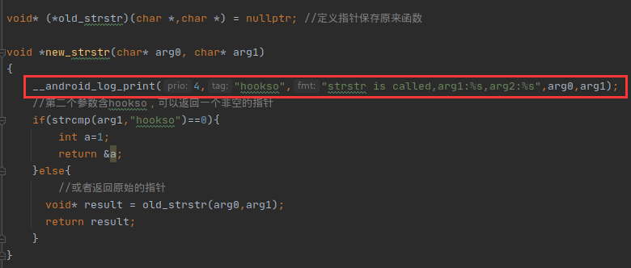

代码分析：

```java
总结：
	我们重定向到新的函数后，首先我们可以打印我们hook函数的参数
	然后我们需要保证strstr能正常的运行
	我们先看strstr原函数的逻辑：
	strstr(str1,str2):
		返回值 如果相等就返回str2在str1中出现的指针
			   反之，返回空指针
    因此我们去一样实现，如果相等，返回一个正常的指针，如果不相等返回空指针
```

然后我们运行hookso程序，发现可以正常hook我们系统函数strstr


流程总结：

```java
我们对一个目标so文件hook步骤如下：
	（1）我们获取so的handler，使用dlopen函数
		void* libhandler = dlopen("libc.so",RTLD_NOW);
	（2）我们获取hook目标函数的地址,使用dlsym函数
		void* strstr_addr = dlsym(libhandler,函数名);
	（3）使用registerInlinehook进行重定向，将hook函数地址重定向我们编写的新函数上
		(registerInlineHook((uint32_t) strstr_addr, (uint32_t) new_strstr, (uint32_t **) &old_strstr) != ELE7EN_OK
		//参数一：hook函数的地址 参数二：替换函数的地址  参数3：用来保存原来函数的地址
	（4）我们在新的函数new_strstr()里面实现hook逻辑，打印参数，而且要保证和原函数一样正常运行
	（5）我们判断我们的hook操作是否成功 
		(inlineHook((uint32_t) strstr_addr) == ELE7EN_OK)
```

#### （4）链接java层和so层

我们将so层编写产生的hookso.so文件拷贝到程序的路径下，并设置权限：

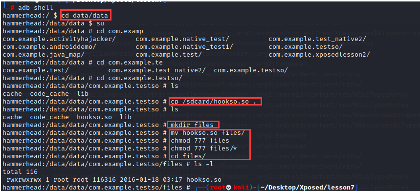

然后我们启动目标程序testso，发现报错


这个原因是我们前面分析的System.loadLibrary()修改了类加载器所导致的，所以我们hook Runtime.loadLibrary()


我们再重启模块，重新打开目标程序


我们可以发现就hook成功了

**注意：经过前面分析，Android 6.0后高版本我们需要hook loadLibrary0**


### 2.64位so文件函数hook——sandhook

64位so文件hook流程和32位一样，只是因为inlinehook并不支持32位，所以我们使用[sandHook](https://github.com/asLody/SandHook)既支持32位、又支持64位

我们将目标函数中的配置块注释，就可以发现在64位机器上运行我们目标函数生成的so就是为64位：

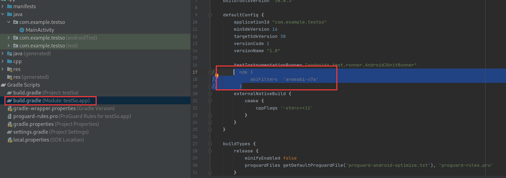

然后我们编写hook代码,先将sandhook模块导入，并配置相关环境：

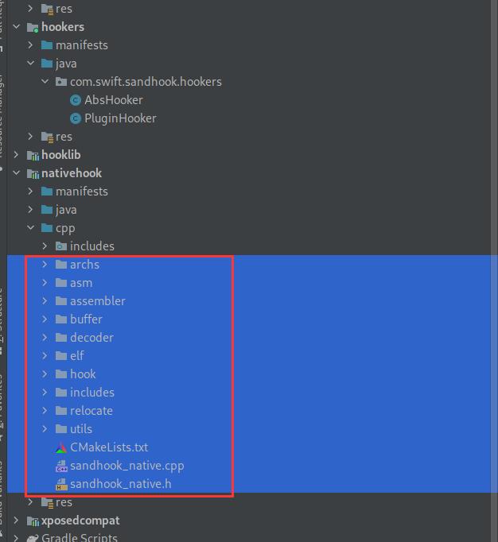


我们编写hook代码：

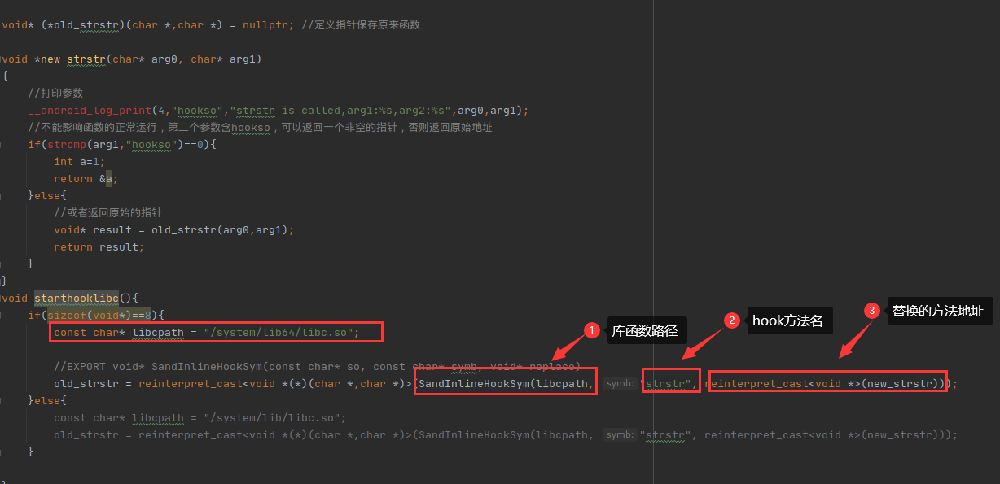

我们生成hook64so.so文件，然后将其导入我们的目标程序下


然后我们运行目标程序，发现报错


我们对地址为空的地方进行了访问

我们对编写的hook函数中sandhook_native进行调试，我们经过调试发现我们的instance是空指针

经过我们分析，我们的hook函数在init中运行，这个是最先运行的

解决办法：

```java
（1）我们在init中添加，并设置优先级，将我们的hook函数优先级设置低一点
（2）我们在JNI_Onload中运行，这样会晚于init
```

然后我们重新运行，我们再将so提取出来，然后推送到我们的目标程序中

我们将目标程序重新安装，发现我们可以成功hook64位的程序


## 六、实验总结

本文总结了程序编译的基本流程，对其中的编译方式和编译链接库做了主要的讲解，然后介绍了inlinehook库的实现原理，借助inlinehook函数来说明内联函数hook的基本原理，还介绍了NDK开发中的一些常见知识，Android中导入链接库的API方法的差异性，最后结合寒冰大佬的案例，总结归纳了Xposed下如何hook32位和64位so文件、不同Android版本的hook方式。

## 七、参考链接

```java
参考书目：《程序员的自我修养——链接、装载与库》
https://blog.csdn.net/sdoyuxuan/article/details/78481239
https://www.cnblogs.com/codingmengmeng/p/6046481.html
https://blog.csdn.net/sssssuuuuu666/article/details/78788369
https://www.malwaretech.com/2015/01/inline-hooking-for-programmers-part-1.html
https://juejin.cn/post/6844903993668272141
```

